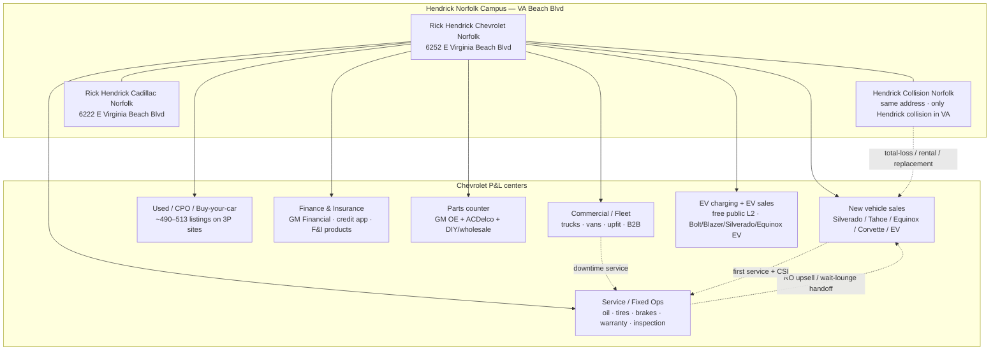
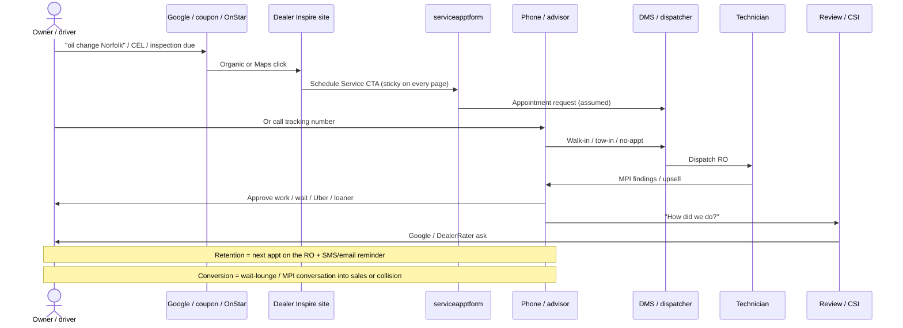
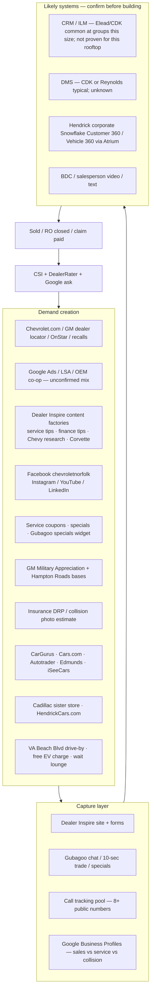
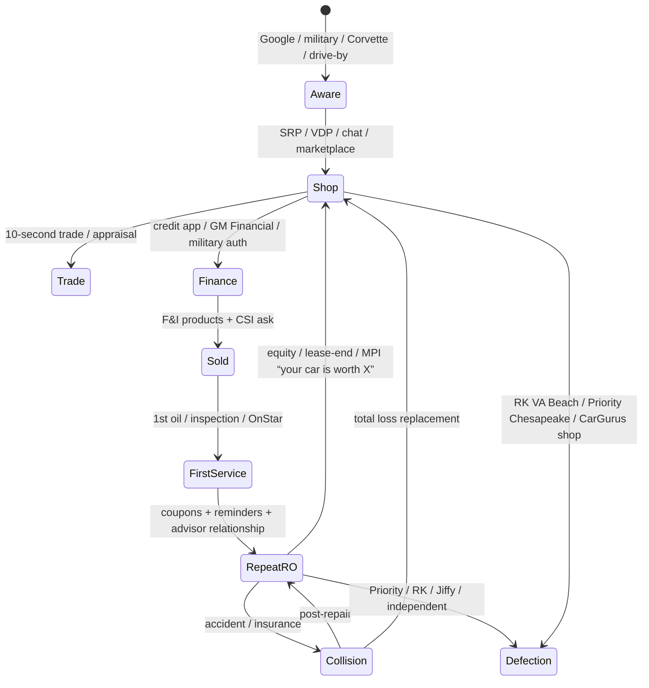

# Rick Hendrick Chevrolet Norfolk — Marketing & Lead Generation Map

**Purpose:** Big-picture view of how this rooftop generates, captures, and loses demand — starting with Service — before any AI backend or marketing system is built.

**Store:** Rick Hendrick Chevrolet Norfolk  
**Legal:** Colonial Chevrolet Company, LP d/b/a Rick Hendrick Chevrolet-Norfolk  
**Address:** 6252 E. Virginia Beach Blvd, Norfolk, VA 23502 (Virginia Beach Blvd corridor; serves Virginia Beach, Chesapeake, Suffolk, Portsmouth, Hampton, Newport News)  
**Owner:** Hendrick Automotive Group (part of the group since 1994; store founded 1930)  
**Campus:** Chevrolet + co-located Hendrick Collision + adjacent Rick Hendrick Cadillac Norfolk (6222 E. Virginia Beach Blvd)

**Method:** Public-web reconnaissance. The dealer site (`rickhendrickchevroletnorfolk.com`, Dealer Inspire / Cloudflare) blocked automated fetches. Findings come from HendrickCars.com, commercial microsite, DealerRater, CarGurus, iSeeCars, PlugShare, collision pages, SEO content snippets, and aggregator listings. Items not verified first-party are marked **unconfirmed**.

**As of:** August 2026

---

## 1. The business in one picture

This is not a single funnel. It is a **campus of P&L centers** that share a brand, a lot, and a customer lifetime — but use different phones, forms, hours, and vendors.



**Implication for AI:** One “marketing system” that only scores website sales leads will miss the highest-frequency, highest-retention engine (Service) and the highest-ticket adjacent capture (Collision + Fleet).

---

## 2. Start here: Service department (fixed ops)

Service is the densest, most repeatable lead machine on the rooftop. It is also the most fragmented in public listings.

### 2.1 Identity

| Item | Observed | Confidence |
|---|---|---|
| Location | 6252 E. Virginia Beach Blvd, Norfolk, VA 23502 | High |
| Hours | Mon–Fri 7:30a–6:00p; Sat 8:00a–4:00p; Sun closed | High (Waze + local listings) |
| Amenities claimed (Hendrick VA service page) | Loaners, pickup/drop-off, vehicle disinfectant, safety inspection | Medium (group page, not store-specific proof) |
| Shuttle | Uber shuttle mentioned in customer reviews | High that it exists at least sometimes |
| Quick lube | PlugShare users reference a “Quick Lube” sign at the service center | Medium |
| Staff named in reviews | Advisors: Will, Grace, Alannah, Molly, Alex, Allan Herrera | Medium (public reviews, not org chart) |

### 2.2 Capture points (the actual “leads”)

```mermaid
flowchart LR
  subgraph triggers ["Demand triggers"]
    T1["Mileage / oil life / CEL"]
    T2["VA state inspection"]
    T3["Warranty / recall / OnStar"]
    T4["Coupon / SEO article"]
    T5["Tow-in / breakdown"]
    T6["Fleet downtime"]
  end

  subgraph channels ["Channels"]
    WEB["Dealer site"]
    PHONE["Call tracking numbers"]
    CORP["HendrickCars.com"]
    SEO["Service-and-parts-tips blog"]
    GBP["Google / Maps / Waze"]
    CHAT["Gubagoo chat / text"]
    WALK["Drive-up / no appointment"]
  end

  subgraph capture ["Capture objects"]
    FORM["/service/serviceapptform/"]
    ALIAS["/schedule-service/"]
    CONTACT["/service/contact-service/"]
    SPECIALS["/service/serviceandpartsspecials/"]
    CALL["Phone → BDC / advisor"]
  end

  subgraph ops ["Store operations"]
    RO["Repair order in DMS"]
    CSI["CSI / review ask"]
    RET["Next-appointment / reminder"]
    XSELL["Service → sales handoff"]
  end

  triggers --> channels --> capture --> ops
```



**Primary URLs**

- Appointment form: [https://www.rickhendrickchevroletnorfolk.com/service/serviceapptform/](https://www.rickhendrickchevroletnorfolk.com/service/serviceapptform/)
- Alias: `/schedule-service/`
- Service home: `/service/`
- Contact service: `/service/contact-service/`
- Coupons: `/service/serviceandpartsspecials/`
- SEO hub: `/service/service-and-parts-tips/` (oil-change price, EV jump-start, Chevy key fob, etc.)
- Corporate referral: HendrickCars VA service page links the same form with  
  `utm_source=hendrickcars&utm_medium=referral&utm_campaign=service`

**Services sold (from HendrickCars + SEO pages + reviews)**

Oil/filter, tire rotation, brakes, batteries, alignments, diagnostics, recalls/software, factory scheduled maintenance, VA state inspection, HVAC, suspension, transmission service, Corvette (including ZR1) work, non-Chevy/GM work (reviewers mention it), fleet/commercial priority scheduling.

**Coupons observed on the specials module (snippets from SEO pages)**

- Battery testing (print coupon)
- Free brake inspection
- Free alignment check with any service
- Fuel injector service
- Lube, oil & filter
- Tire rotation **$21.95**
- Power steering service (Hendrick-branded offer; full price **unconfirmed**)

Exact current oil-change package price was **not** verified first-party (Cloudflare block).

### 2.3 Service customer journey



### 2.4 What service reviews actually say

**Strengths (repeatable):** advisor communication (named people), Corvette competence, Uber shuttle, willingness to take no-appointment emergencies, warranty battery work even when the part was bought elsewhere.

**Failures (repeatable, high-severity):** vehicles sitting days/weeks after tow-in, RO not in the system, aggressive estimates vs. simple corrosion cleanup, missed appointment dates, poor callback. These are **process + CRM** problems, not awareness problems.

**Reputation split**

| Surface | Score | Volume | Role |
|---|---|---|---|
| Google (sales GBP, via Places) | **4.7** | **9,506** | Primary Hendrick CSI destination; supports “#1 Google Rated” claim |
| DealerRater | 4.6 | 732 | Sales + some service; Cars.com syndicates this |
| Collision GBP | ~4.0 | ~467 | Separate brand / separate ask |
| Yelp | **~2.3** | **165** | Untreated complaint sink (Apple Maps surfaces this) |

Service-only Google volume is **not** cleanly isolated from the sales GBP. Yelp reviews already include the failure mode “I had an appointment and was told 48–72 hours before they could look at the car.” That is a scheduling-honesty problem, not an awareness problem.

### 2.5 Service competitive set (Hampton Roads)

| Competitor | Why they steal ROs |
|---|---|
| [Priority Chevrolet Greenbrier](https://www.prioritychevrolet.com/) (Chesapeake) | Same GM certified-service playbook; Sat service to **5pm** (vs Hendrick Sat to 4pm); explicit coupon codes on oil |
| [RK Chevrolet](https://www.rkchevrolet.com/) (Virginia Beach) | Geographic steal for VB/Oceanfront; **RK Express Lube**; night drop; shuttle (Mon–Fri, ~10 miles) |
| Jiffy Lube / Take 5 / Firestone / Pep Boys | Price + no-appt convenience for oil/tires |
| Independents on the same boulevard | Mack's, Terry's, NAPA, Crash Champions — cheaper / faster for out-of-warranty |
| Other Chevy rooftops | Customers explicitly say they pass a closer Chevy store because Hendrick advisors are better — **advisor brand is the moat** |

### 2.6 Service-specific leaks (fix before buying more ads)

1. **Wrong destination URL on local listings.** CarHQ (and likely other scrapers) send “Rick Hendrick Chevrolet Norfolk Service” to the **Cadillac** appointment form:  
   `rickhendrickcadillacnorfolk.com/service/serviceapptform/?utm_source=weblistings&utm_medium=organic&utm_campaign=hendricklocallistings`  
   Chevy demand is being handed to the sister store.
2. **Phone number sprawl.** Service is advertised as `(757) 271-1678`, `(757) 544-9732`, `(855) 608-4343`, plus body/fleet numbers in the same footer. Attribution and Google Business hygiene are broken.
3. **Sticky CTAs fight each other.** Every page footer pushes **Schedule Service** and **10 Second Trade** equally — good for lifetime value, noisy for intent.
4. **Tow-in / no-appt is a lead class with no public SLA.** That is where 1-star service reviews are born.

---

## 3. Recurse: the rest of the rooftop

### 3.1 New vehicle sales

**Positioning:** “#1 Google Rated Chevy Dealership in Norfolk”; “#1 Corvette Dealer in Virginia”; Corvette specialist **Tyler Sellers** (page) / **Tyler Duncan** (reviews). Homepage IA includes Trucks, Electric, SUVs, Performance, Commercial.

**Hero products (HendrickCars + site IA):** Silverado 1500/HD, Tahoe, Suburban, Equinox, Traverse, Colorado, Corvette C8, Camaro (research pages still live), EV trio (Silverado EV, Blazer EV, Equinox EV).

**Capture**

| Object | URL / channel |
|---|---|
| VDP / SRP inventory | `/new-vehicles/` |
| New specials | `/new-vehicles/new-vehicle-specials/` |
| Contact form | `/contactusform/` and `/contact-us/` |
| Chat / text | Gubagoo widget (`cdn.gubagoo.io` on pages) |
| Video intro from salesperson | DealerRater: Brady Roundtree sent a video after a web hit |
| OEM / co-op offers | 0% APR 36 mo via GM Financial; 90-day payment defer; MSRP discounts; military program |

**Hours (sales, HendrickCars):** Mon–Sat 9:00a–8:00p; Sunday closed (commercial microsite says last Sunday of month open).

### 3.2 Used / CPO / buy-your-car

Public third-party inventory is large and mixed-make (not a Chevy-only used lot):

- CarGurus: **491 cars** listed
- iSeeCars: **513 cars**, avg price ~$34k, avg miles ~52.6k, **3.5 / 5** dealer ops score (price + data quality). Only **64%** of listings have valid price + miles + photo vs 75% average — a **marketplace conversion leak**.
- Autotrader dealer page exists at `/car-dealers/norfolk-va/100009/rick-hendrick-chevrolet-norfolk` (page was unavailable to fetch).
- AutosToday: **350** cars shown on their scrape (different filter / freshness than CarGurus).

Used specials: `/used-vehicles/used-vehicle-specials/`  
Trade: `/value-your-trade/` branded **“10 Second Trade”** (Gubagoo). HendrickCars: they buy all makes/models.

### 3.3 Finance & insurance

| Object | Notes |
|---|---|
| Credit app | `/finance/apply-for-financing/` |
| Finance SEO hub | `/finance/car-buying-tips/` (trade-in repair, used leases, unpaid trades) |
| Captive | GM Financial required on several advertised APRs |
| Military | HendrickCars: “dedicated programs for military personnel”; OEM overlay is [GM Military Appreciation](https://www.gmmilitaryappreciation.com/) via ID.me |
| Collision financing | **Sunbit** on the collision page (not the Chevy finance page) |

Homepage legal also referenced `gmmilitaryapp` — military is in the offer stack even if the store landing page was not fetched.

### 3.4 Parts

HendrickCars: “one of the most comprehensive GM parts inventories in the Norfolk area.” A **wholesale parts department exists** (staff titles + a 2026 E.D. Va. filing describing commission on retail and wholesale). Public wholesale portal: **not found**. Hours: **unknown** from a primary page.

| Capture | Notes |
|---|---|
| `/parts/` | Indexed; live form **unverified** (Cloudflare) |
| Likely `/parts/partsorderform/` | Cadillac next door publishes this Dealer Inspire pattern |
| Phone | Footer `(757) 271-1678`; older club listing `(757) 455-4500` “ask for Bill” — **currency unknown** |
| GM Accessories | [accessories.chevrolet.com/?bac=164265](https://accessories.chevrolet.com/?bac=164265) ship-to-home or dealer pickup |

**Lead types:** retail DIY, wholesale/body shops, internal ROs, GM.com accessories pickup. There is **no named accessories department page**. Hendrick Performance (Charlotte) is **not** a Norfolk department.

### 3.5 Collision (separate brand, same address)

[Hendrick Collision Chevrolet Norfolk](https://www.hendrickcars.com/virginia/norfolk/rick-hendrick-chevrolet-collision-center.htm)

| Item | Detail |
|---|---|
| Phone | **(757) 455-4505** (Carwise/HendrickCars). Footer also dumps “Body Shop” into the 271-1678 pool. |
| Hours | M–F 7:30a–5:30p; Sat 8:00a–12:00p; after-hours night drop (key + contact in envelope) |
| Position | **Only Hendrick Collision in Virginia**; 11 OEM certs including **C8 Corvette**, Honda/Acura, Subaru, Lexus, Kia, Hyundai, Nissan/Infiniti, CDJR/Fiat; I-CAR Gold |
| Stack | **Carwise shop 550635** + **CCC** photo estimate and book-appointment (optional insurance company). HendrickCars: schedule, photo estimate, contact form. Carwise **Shop Assistant** already sits on intake. |
| Pay | Sunbit; limited lifetime on body/paint |
| GBP | ~467 reviews @ ~4.0 (aggregator) |
| DRP list | **Not published** — “works with all major carriers” |

This is an **insurance-inbound + photo-estimate** lead engine, not a Google-Ads-for-cars engine. Cadillac has no collision shop of its own; this facility is the campus body shop. It also feeds sales (total loss) and service (post-repair alignments, ADAS calib). **Do not duplicate CCC** — orchestrate in front of it.

### 3.6 Commercial / fleet (B2B)

Platform is **Work Truck Solutions** (`commercial.rickhendrickchevroletnorfolk.com` / `rickhendrickchevroletnorfolk.worktrucksolutions.com`).

| Item | Detail |
|---|---|
| Sales phone | **(757) 300-1588** |
| Footer fleet phone | **(757) 760-8103** (distinct from the 271-1678 cluster) |
| Ignore | `(336) 814-9753` on some VDPs — platform tracking, not a Norfolk DID |
| Named “Truck Pros” | Steve Ciccone, Nathan Preston, DJ Lord |
| Offer | Mixed-make work trucks/vans (Chevy plus Ford, Ram, GMC, etc.), upfits (Knapheide, Reading, Stahl, Utilimaster, BrightDrop), **Section 179 / bonus depreciation**, Autoguard F&I, commercial service with priority scheduling |
| Capture | Per-unit Get Sale Price · Help Me Find (vocation dropdown: contractor, government, police, HVAC…) · EZOrder / customorders · Digital Commercial Catalog / VanBuilder |
| Hours on microsite | Sales-like: M–F 9–8, Sat 9–6, last Sunday of month |

Two fleet numbers = two lead owners or a tracking vs. direct split. Needs a human confirmation before CRM mapping. Hendrick **Fast Pass** exists at group/Cadillac; Chevy Fast Pass URL was **not live-verified**.

### 3.7 EV as a marketing surface (not just a model line)

[PlugShare location 47383](https://www.plugshare.com/location/47383): free public J1772 Level 2 at the store (showroom + service/Cadillac side). Historical CCS/DC fast under the Quick Lube sign appears **removed or broken** in later check-ins. Mixed reviews: “lifesaver / free” vs blocked stalls and dead hardware.

This is unpaid **physical media** for EV shoppers and travelers on I-64/I-264. It currently generates goodwill *and* 1-star charging comments — an ops problem with marketing consequences. HendrickCars sells Silverado EV / Blazer EV / Equinox EV; **Bolt as a current program is not stated** (only PlugShare comments). There is **no EV-department phone or form**.

---

## 4. Full lead-generation ecosystem



### 4.1 Channel inventory

| Layer | What we know | Gap |
|---|---|---|
| Website | Dealer Inspire on `gm.websites.dealerinspire.com`; heavy SEO content; sticky Schedule Service + 10 Second Trade | Cloudflare-walled; form field map unknown |
| Chat/trade | Gubagoo (footer/scripts on Corvette and research pages) | Chat transcripts not public |
| Corporate web | HendrickCars.com store + collision + VA service hub with UTMs | Duplicate listings vs rooftop site |
| Commercial | Separate microsite + named truck team | Unclear if leads land in same CRM |
| Marketplaces | CarGurus 491 · iSeeCars 513 · Cars.com reviews 817 · DealerRater 732 | Listing data quality below average |
| Social | Facebook [`chevroletnorfolk`](https://www.facebook.com/ChevroletNorfolk/) · Instagram [`@rickhendrickchevroletnorfolk`](https://www.instagram.com/rickhendrickchevroletnorfolk/) (active; follower count **unconfirmed**, search snippets say 1k+) · LinkedIn company page (47 followers, still lists `colonialchevroletnorfolk.com`) · YouTube handle referenced | Cadence and paid social mix unknown |
| Reviews | **Google 4.7 / 9,506** (Capital One pulling Google Places) · DealerRater 4.6/732 · Cars.com ~816 (includes DealerRater) · AutosToday 4.5/5,698 · Collision GBP ~4.0/467 · **Yelp ~2.3 / 165** (Apple Maps) | Store claim “#1 Google Rated Chevy in Norfolk” is consistent with a very large Google volume. Yelp is the untreated complaint sink. |
| Military | OEM program + Hendrick copy aimed at NAS Norfolk, Oceana, Langley-Eustis, Fort Story | Store-level military landing page **not fetched** |
| Call tracking | See §5 | Attribution soup |

### 4.2 Website information architecture (lead objects)

```text
rickhendrickchevroletnorfolk.com
├── /                          home + geo copy (VB, Chesapeake, Suffolk)
├── /new-vehicles/             SRP
├── /new-vehicles/new-vehicle-specials/
├── /new-vehicles/{model}/     e.g. Camaro research CTAs
├── /new-corvette-c8-mid-engine-norfolk-va/
├── /used-vehicles/
├── /used-vehicles/used-vehicle-specials/
├── /chevy-research/           SEO
├── /finance/
├── /finance/apply-for-financing/
├── /finance/car-buying-tips/
├── /value-your-trade/         "10 Second Trade"
├── /contact-us/  /contactusform/
├── /service/
├── /service/serviceapptform/  ★ primary service lead
├── /schedule-service/         alias
├── /service/contact-service/
├── /service/serviceandpartsspecials/
└── /service/service-and-parts-tips/
     ├── oil-change-price/
     ├── how-often-should-you-change-your-oil/
     ├── how-to-jump-start-an-ev/
     └── how-to-program-chevy-key-fob/

commercial.rickhendrickchevroletnorfolk.com
hendrickcars.com/virginia/norfolk/rick-hendrick-chevrolet-norfolk.htm
hendrickcars.com/virginia/norfolk/rick-hendrick-chevrolet-collision-center.htm
```

Sticky sitewide CTAs: **Schedule Service!** + **10 Second Trade**. Gubagoo specials tray on at least some pages.

---

## 5. Phone & listing hygiene (attribution problem)

Public numbers attached to this rooftop (many are call-tracking, not DID):

| Number | Where it appears | Likely use |
|---|---|---|
| (757) 271-1678 | Site footer: Main/Sales/Service/Parts/Body | Primary tracking pool |
| (757) 544-9732 | Waze, CarHQ service listing | Service GBP / local pack |
| (757) 544-9847 | HendrickCars FAQ | Store |
| (855) 608-4343 | HendrickCars header | Corporate tracking |
| (833) 761-3956 | DealerRater | Sales tracking |
| (757) 300-1588 | Commercial microsite | Fleet sales |
| (757) 760-8103 | Site footer “Fleet” | Fleet / commercial |
| (757) 455-4505 | Collision page | Collision |
| (757) 916-5045 / 5048 | Older page scrapes | Retired tracking? |
| (757) 216-1670 | Third-party directories | Unconfirmed |
| (757) 266-5804 | Apple Maps | Another tracking or DID — unconfirmed |

Until these are mapped to departments and to CRM lead sources, **no AI scoring model will be trustworthy**.

---

## 6. Customer lifetime — the real unit of marketing

Dealership marketing is not “get a lead.” It is **own the vehicle’s life in Hampton Roads**.



**Highest-leverage loops (in order):**

1. Service advisor relationship → next RO (already the moat).
2. Service MPI / wait lounge → used or new sale.
3. Collision total-loss → replacement sale (reviews already show this happening).
4. Military PCS cycle → new sale + service retention.
5. Fleet downtime → truck sale + upfit + commercial RO.

---

## 7. Market & competitive frame

**Geo:** Norfolk address, Virginia Beach demand. Copy explicitly targets Chesapeake, Suffolk, Hampton, Newport News, Williamsburg, Eastern Shore, and the bases.

**Chevy franchise competitors**

- Priority Chevrolet Greenbrier — Chesapeake (Military Hwy) — strongest southside competitor
- RK Chevrolet — Virginia Beach Blvd (different stretch) — strongest VB competitor; Express Lube is a convenience weapon
- Other GM/Hendrick: Cadillac next door (partner and listing-leak destination)

**Non-Chevy groups:** Checkered Flag (Honda/parts on the same boulevard; used outlet), Hall, independents, national quick-lube.

**Audience overlays unique to this market**

- Naval Station Norfolk, NAS Oceana, Joint Base Langley-Eustis, Fort Story, shipyards
- Pickup / HD truck + commercial (port, trades, military)
- Corvette / performance (store leans in; collision is C8-certified)
- EV curiosity (free charge + Bolt/Blazer/Equinox/Silverado EV)

---

## 8. Tech stack — known vs assumed

| Layer | Evidence | Status |
|---|---|---|
| Website | Cloudflare block names `gm.websites.dealerinspire.com` | **Known** |
| Chat / trade / specials | `cdn.gubagoo.io` on pages | **Known** |
| Corporate data | Hendrick × Atrium × Snowflake Customer 360 / Vehicle 360 (lead scoring, inventory, personalization at **group** level) | **Known for group, not this store’s access** |
| CRM / BDC | Elead/CDK is common at this scale; salesperson video-after-web-lead is a CRM/BDC behavior | **Unconfirmed for this rooftop** |
| DMS | Unknown (CDK vs Reynolds). Needed for RO, inventory, F&I | **Unknown** |
| Reputation | DealerRater responses exist; at least one reply addressed **Land Rover Charlotte** on a Norfolk review — corporate or shared-queue response | Process gap |
| Collision finance | Sunbit | **Known** |
| EV listing | PlugShare | **Known** |
| Legacy domain | `colonialchevroletnorfolk.com` still resolves to this brand; LinkedIn still uses it | Hygiene gap |

**Do not build a parallel CRM.** Any store-level AI should sit **on top of** Hendrick’s Snowflake/DMS/CRM, or it will be unsustainable the first time corporate IT notices.

---

## 9. Where the picture is still blind

These are the next facts to pull from a human at the store / group (or from logged-in vendor consoles) before engineering:

1. DMS + CRM + BDC vendors and whether service and sales share a customer record.
2. True DIDs vs. tracking numbers; which GBP is canonical for Service vs Sales vs Collision.
3. Monthly lead volumes by source (Dealer Inspire, Gubagoo, Cars.com, CarGurus, Google LSA, OEM, walk-in, phone).
4. Show rate and no-show rate on `serviceapptform`.
5. Service reminder vendor (email/SMS) and whether it is mileage-based or time-based.
6. Whether insurance DRP relationships are exclusive for collision.
7. Military / first responder / college grad offer handling in F&I.
8. Parts e-commerce and wholesale account process.
9. Who owns the Cadillac listing leak and HendrickCars duplicate pages.
10. Access (if any) to corporate Snowflake Customer 360 for this rooftop.

---

## 10. What to build later (not now) — AI system overlay

This is a **target architecture**, not an implementation plan.

```mermaid
flowchart LR
  subgraph ingest ["Ingest"]
    L1["Web forms / Gubagoo"]
    L2["Call tracking + transcript"]
    L3["DMS ROs + inventory"]
    L4["GBP / DealerRater"]
    L5["Insurance / photo estimates"]
    L6["Marketplace messages"]
  end

  subgraph brain ["Store intelligence — after vendor map"]
    ID["Identity resolution<br/>phone + VIN + household"]
    SCORE["Intent + next-best-action<br/>service vs sales vs collision vs fleet"]
    SLA["Tow-in / no-appt SLA watchdog"]
    REV["Review reply that is rooftop-correct"]
    ATTR["Source-of-truth attribution"]
  end

  subgraph act ["Actions"]
    A1["Advisor SMS: MPI in plain language"]
    A2["No-show recovery"]
    A3["Service → equity sales handoff"]
    A4["Listing completeness fixer"]
    A5["Military / PCS playbooks"]
    A6["Charging stall + hardware status"]
  end

  ingest --> brain --> act
```



**Do first (highest ROI, lowest politics)**

1. **Listing & tracking cleanup** — Cadillac form leak, phone map, GBP split, iSeeCars photo/price completeness.
2. **Service appointment reliability** — confirmations, no-shows, tow-in queue visibility (this is where 1-star reviews come from).
3. **Advisor-branded retention** — the public already names Will, Alannah, Molly, Grace; productize that.
4. **Collision photo-estimate → sales** for total loss.
5. **Marketplace data quality** so CarGurus/iSeeCars stop taxing conversion.

**Do not do first**

- Another chatbot on Dealer Inspire (Gubagoo already occupies that slot).
- A net-new CRM.
- Generic “AI marketing” that blasts specials without VIN/RO context.

---

## 11. Source list

- [Dealer site home](https://rickhendrickchevroletnorfolk.com/) (Cloudflare-blocked to scrapers; snippets via search)
- [Service appointment form](https://www.rickhendrickchevroletnorfolk.com/service/serviceapptform/)
- [HendrickCars store page](https://www.hendrickcars.com/virginia/norfolk/rick-hendrick-chevrolet-norfolk.htm)
- [Hendrick VA service hub](https://www.hendrickcars.com/service-virginia.htm)
- [Collision center](https://www.hendrickcars.com/virginia/norfolk/rick-hendrick-chevrolet-collision-center.htm)
- [Commercial about](https://commercial.rickhendrickchevroletnorfolk.com/about)
- [Commercial home / Work Truck Solutions](https://commercial.rickhendrickchevroletnorfolk.com/)
- [Section 179](https://commercial.rickhendrickchevroletnorfolk.com/p/tax-section-179)
- [Carwise collision 550635](https://www.carwise.com/auto-body-shops/rick-hendrick-chevrolet-collision-norfolk-norfolk-va-23502/550635)
- [Carwise photo estimate](https://www.carwise.com/online-photo-estimate/rick-hendrick-chevrolet-collision-norfolk-norfolk-va-23502/550635)
- [GM Accessories BAC 164265](https://accessories.chevrolet.com/?bac=164265)
- [Hendrick Performance (Charlotte — not this rooftop)](https://www.hendrickperformance.com/corvettes.aspx)
- [Corvette C8 landing](https://www.rickhendrickchevroletnorfolk.com/new-corvette-c8-mid-engine-norfolk-va/)
- [Oil-change SEO](https://www.rickhendrickchevroletnorfolk.com/service/service-and-parts-tips/oil-change-price/)
- [DealerRater](https://www.dealerrater.com/dealer/Rick-Hendrick-Chevrolet-Norfolk-dealer-reviews-23389/)
- [Google rating via Capital One / Places](https://www.capitalone.com/cars/dealership/NORFOLK-VA/Rick+Hendrick+Chevrolet+VA/1959) (4.7 / 9,506)
- [CarGurus dealer](https://www.cargurus.com/Cars/m-Rick-Hendrick-Chevrolet-Norfolk-sp267210)
- Instagram: [rickhendrickchevroletnorfolk](https://www.instagram.com/rickhendrickchevroletnorfolk/)
- Autotrader dealer id 100009
- [iSeeCars dealer](https://www.iseecars.com/dealer-717056-rick-hendrick-chevrolet-norfolk-in-norfolk-va)
- [PlugShare](https://www.plugshare.com/location/47383)
- [GM Military Appreciation](https://www.gmmilitaryappreciation.com/)
- [Hendrick Snowflake / Atrium](https://atrium.ai/customers/building-a-unified-data-foundation-with-snowflake-for-hendrick-automotive-group/)
- Competitors: [Priority Chevrolet](https://www.prioritychevrolet.com/), [RK Chevrolet](https://www.rkchevrolet.com/)
- Facebook: [chevroletnorfolk](https://www.facebook.com/ChevroletNorfolk/)
- LinkedIn: [Rick Hendrick Chevrolet - Norfolk, Virginia](https://www.linkedin.com/company/rick-hendrick-chevrolet---norfolk-virginia)

---

## 12. How to read this before building

Service is not a sidecar. For this store it is the **always-on acquisition and retention channel**, with sales as episodic high-ticket conversion and collision/fleet as specialized capture. The public internet already shows a competent advisor culture, a serious Corvette/collision specialty, a huge mixed-make used operation, and sloppy listing/phone hygiene.

The first AI-powered system worth building is not a campaign engine. It is a **rooftop operating picture**: one identity per customer and VIN, every lead source mapped, service SLAs visible, and next-best-action that respects Hendrick corporate data — not a second brain that fights it.
