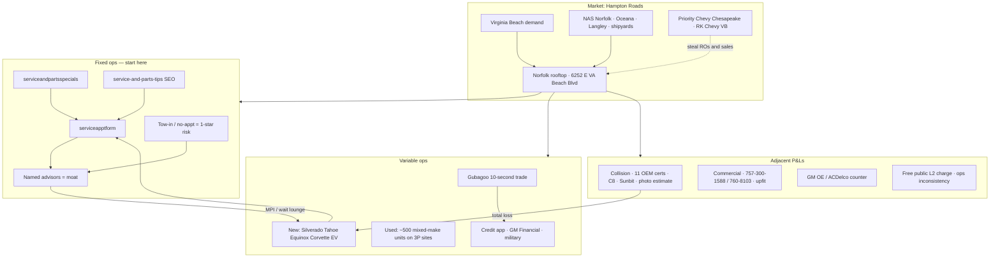

# Rooftop poster — Rick Hendrick Chevrolet Norfolk

One-screen view of demand. Detail lives in [marketing-leads-map.md](./marketing-leads-map.md).

## Capture objects to wire first

| Priority | Object | Why |
|---|---|---|
| 1 | `/service/serviceapptform/` | Highest-frequency lead; corporate UTM already exists |
| 2 | Service Google/Waze number `(757) 544-9732` vs site pool `(757) 271-1678` | Attribution is currently soup |
| 3 | Cadillac form leak on Chevy local listings | Demand handed to sister store |
| 4 | Gubagoo chat + 10-second trade | Occupies the on-site conversation slot |
| 5 | Collision photo estimate + `(757) 455-4505` | Insurance inbound, not retail ads |
| 6 | CarGurus / iSeeCars listing completeness | 64% valid price+photo+miles |
| 7 | Commercial phones and truck-pros desk | B2B is a different CRM object |
| 8 | Marketplace + DealerRater + GBP replies | Shared-queue replies already misfire |

## Do not build yet

A second CRM, a second chatbot, or blast campaigns. Hendrick already has Dealer Inspire, Gubagoo, and a corporate Snowflake Customer 360. The store needs an operating picture on top of those, starting with Service SLAs and listing hygiene.
